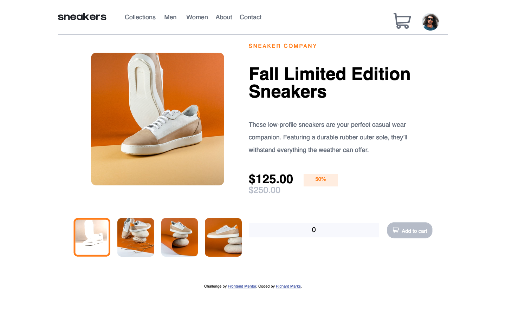

# Frontend Mentor - E-commerce product page solution

This is a solution to the [E-commerce product page challenge on Frontend Mentor](https://www.frontendmentor.io/challenges/ecommerce-product-page-UPsZ9MJp6). Frontend Mentor challenges help you improve your coding skills by building realistic projects.

### The challenge

Users should be able to:

- View the optimal layout for the site depending on their device's screen size
- See hover states for all interactive elements on the page
- Open a lightbox gallery by clicking on the large product image
- Switch the large product image by clicking on the small thumbnail images
- Add items to the cart
- View the cart and remove items from it

### Screenshot

### Links

- Solution URL: [https://github.com/Richard2957/ecommerce-product-page-main](https://github.com/Richard2957/ecommerce-product-page-main)
- Live Site URL: [https://richard2957.github.io/ecommerce-product-page-main/](https://richard2957.github.io/ecommerce-product-page-main/)

### Built with

- HTML
- CSS
- Javascript (vanilla)

### Hardest bit

Getting the borders around the thumbnails to work

### Funnest bit

The little orange number on the basket

## Author

- Frontend Mentor - [@richard2957](https://www.frontendmentor.io/profile/richard2957)
- Twitter - [@richard2957](https://www.twitter.com/richard2957)

